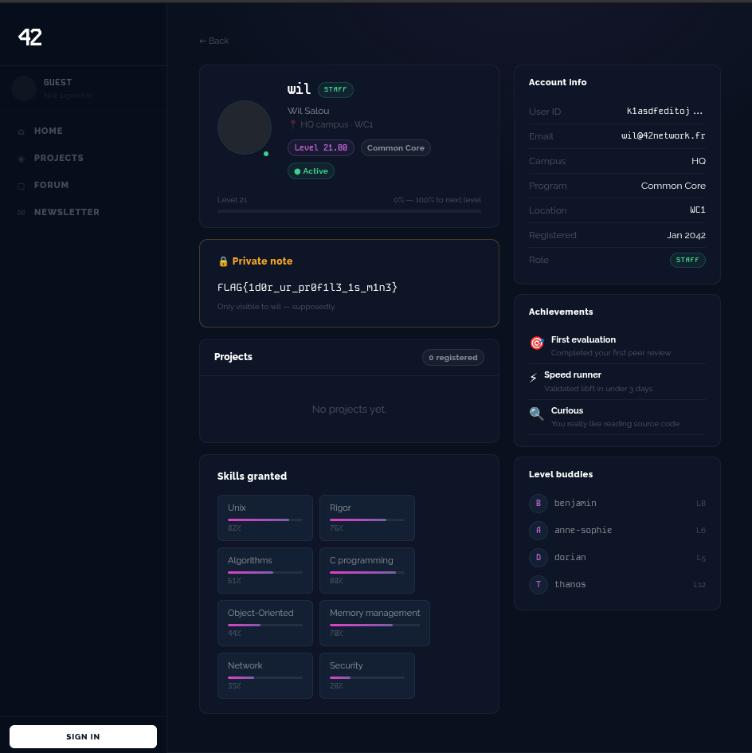
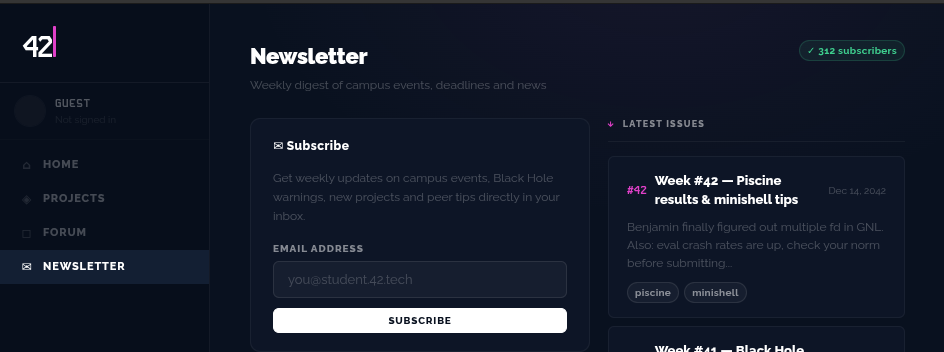
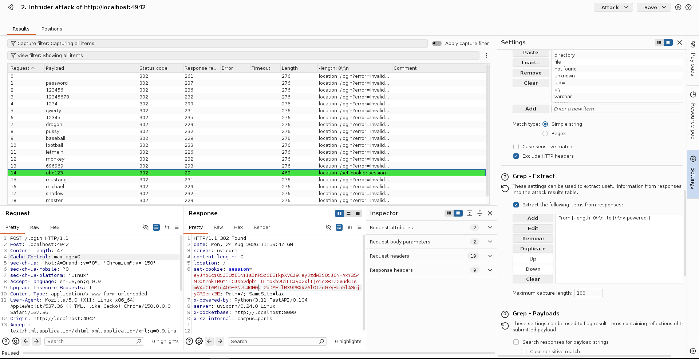
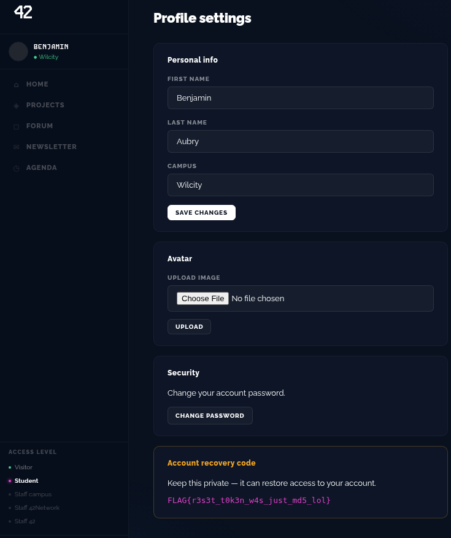
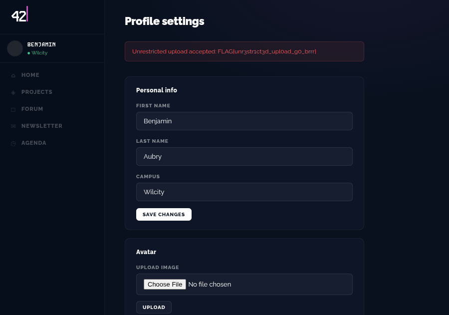
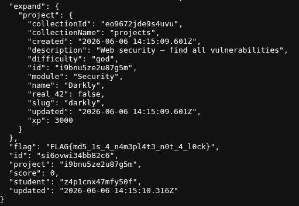
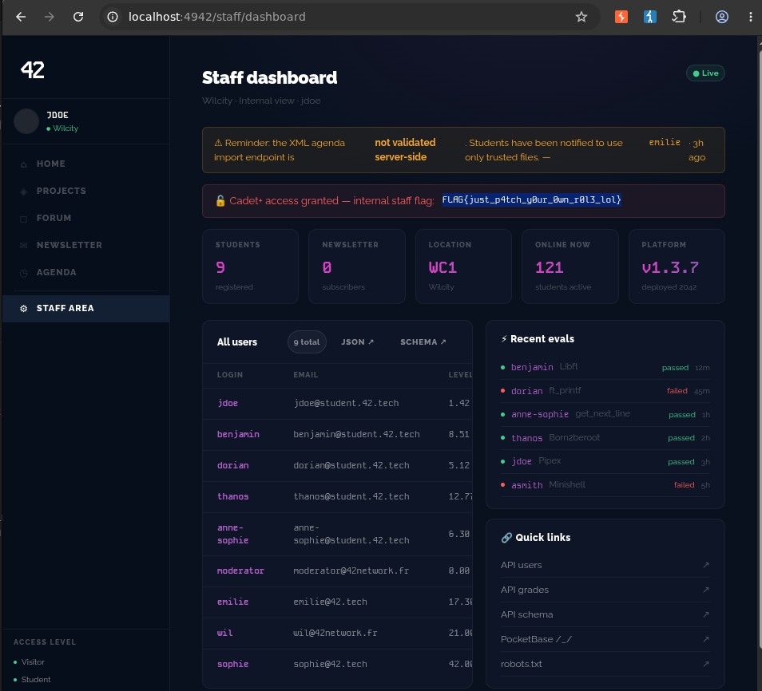
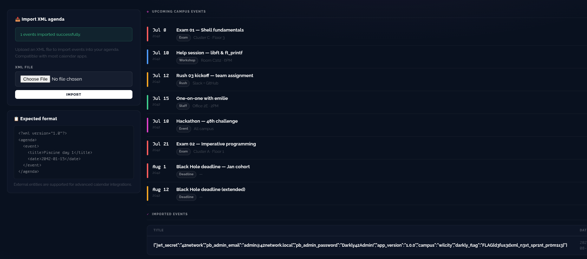
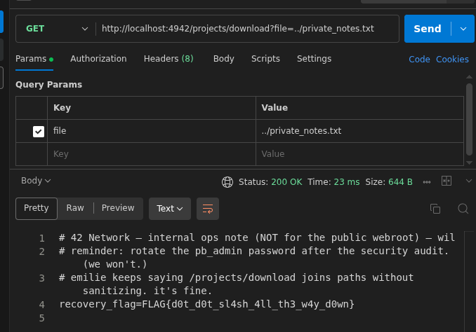

# Darkly 2.0 - Kill chain

### 1 - Unanthenticated information disclosure (A01)  
**[README.md](./src/A01_BrokenAccessControl/A01_Breach1/README.md)**  
Point de depart : Aucun compte necessaire  

Parcours de decouverte : `Forum -> Wil's post -> View Profile -> Flag`.  

  

Flag : `FLAG{1d0r_ur_pr0f1l3_1s_m1n3}`  

### 2 - Account takeover

#### 2.1 - Option 1 (sans flag) BruteForce
**[README.md](./src/BruteForce/README.md)**  
Point de depart : Connaitre le domaine d'une addresse mail user  

- On peut avoir cette info ici : `http://localhost:4942/newsletter`

  

- BruteForce le mot de passe de John Doe qui se vante d'un faible mdp sur le forum  



```
email = jdoe@student.42.tech
password = abc123
```

#### 2.2 - Option 2 (avec flag) - Password Reset Flaw
**[README.md](./src/A07_Identification_and_Authentication_Failures/A07_Breach1/README.md)**  
Point de depart : Connaitre le domaine d'une addresse mail user. Attaquer Benjamin, c'est cet user qui donne le flag. 

  

Flag : `FLAG{r3s3t_t0k3n_w4s_just_md5_lol}`

#### 2.3 - Option 3 (avec flag egalement) - Cookie Grabber sur le ModBot
**[README.md](./src/A03_Injection/A03_Breach1/README.md)**  
Point de depart : Avoir decouvert le query parameter qui renvoie son argument + Avoir un compte utilisateur pour pouvoir poster un commentaire. 


Flag : `FLAG{xss_st0r3d_1s_n0t_4_f34tur3_w1l}`


### 3 - Unrestricted file upload  
**[README.md](./src/A05_Security_Misconfiguration/Breach1/README.md)**  
Point de depart : Avoir un compte utilisateur



Flag : `FLAG{unr3str1ct3d_upl0ad_g0_brrr}`

### 4 - IDOR / BOLA - Acces aux notes des autres users (A01)
**[README.md](./src/A01_BrokenAccessControl/A01_Breach3/README.md)**  
Point de depart : Avoir un compte utilisateur  

- A un utilisateur authentifie, l'API expose la liste complete des utilisateurs via `GET /api/users` + leurs `id`, on peut donc exploiter `GET /api/grades?student={id}`.

  

Flag : `FLAG{md5_1s_4_n4m3pl4t3_n0t_4_l0ck}`

### 5 - Vertical Privilege Escalation  
**[README.md](./src/A01_BrokenAccessControl/A01_Breach2/README.md)**  
Point de depart : Avoir un compte utilisateur

- Une requete PATCH avec les bons champs permet de modifier son role sur la WebApp et realiser une privilege escalation.  

  

Flag : `FLAG{just_p4tch_y0ur_0wn_r0l3_lol}`


### 6 - Admin Credentials via XXE-SSRF  
**[README.md](./src/A05_Security_Misconfiguration/Breach2/README.md)**  
Point de depart : Avoir un compte utilisateur avec les droits `Cadet` a minima.  

- `defusedxml` est desactive, le parser XML en place resout les entites externes et nous permet de recuperer les credentials admin via une faille XXE-SSRF, merci le serveur.  

  

Flag : `FLAG{d3fus3dxml_n3xt_spr1nt_pr0m1s3}`

### 7 - PocketBase Admin Panel  
**[README.md](./src/A04_Insecure_Design/README.md)**
Point de depart : Avoir un compte utilisateur avec les droits `Cadet` a minima. 

- Les credentials admin recuperes lors de l'exploitation de la precedente faille nous permet d'avoir acces au panel Admin de PocketBase et recuperer le flag correspondant a l'escalation `God`.  

Flag : `FLAG{th3_und3rsc0r3_sl4sh_kn0ws_th3_w4y}`

### 8 - Path traversal  
**[README.md](./src/A01_BrokenAccessControl/A01_Breach4/README.md)**  
Point de depart : Avoir un compte utilisateur  

- En exploitant le Path Traversal, on peut telecharger des fichiers qui ne devrait normalement pas pouvoir etre accessible au client.  

  

Flag : `FLAG{d0t_d0t_sl4sh_4ll_th3_w4y_d0wn}`
