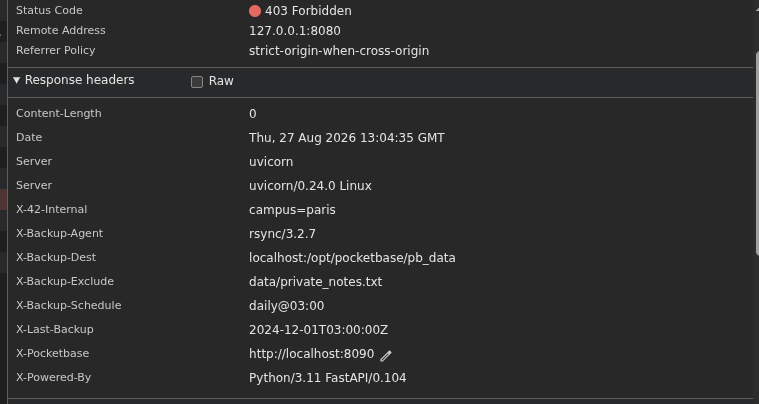

**A01 - Broken Acces Control - Path Traversal (LFI)**  

Definition :  

Cette vulerabilite correspond a une absence de controle sur les chemins de fichiers fournis par l'utilisateur.  

La WebApp utilise le queryParameter `?file=` pour determiner le fichier elle doit retourner, seulement, il n'y a pas de sanitize sur le chemin fourni.  

On peut donc utiliser `../` pour remonter l'arborescence et demander a l'app de nous servir le fichier demande.  

[Source](https://owasp.org/www-project-web-security-testing-guide/latest/4-Web_Application_Security_Testing/07-Input_Validation_Testing/11.1-Testing_for_File_Inclusion)

**Processus de decouverte / reprodution**  

Quelque part dans le code source, on un indice qui nous dit `de regarder les headers des reponses HTTP, qui donne beaucoup plus d'infos que l'on ne pense.`  

En testant les routes fournies dans le fichier `robots.txt`, on repere quelque chose de tres interessant dans le header de la requete GET vers `localhost:4942/backup`, qui renvoie une 403, contrairement a d'autre 404.  



```
x-backup-agent: rsync/3.2.7     |   Agent de sauvegarde qui tourne cote serv, base sur rsync  

x-backup-dest:localhost:/opt/pocketbase/pb_data     |   Backend qui utilise PocketBase comme BDD, donnees stockees dans /opt/pocketbase/pb_data sur la machine  

x-backup-exclude: data/private_notes.txt        |   Un fichier private_notes.txt existe dans /data, exclu volontairement des sauvegardes, probablement qu'il contient des donnees sensibles a exploiter
```

Ce qui est interessant, c'est qu'on sait que la route : `http://localhost:4942/projects/download?file=` nous permet d'acceder a une fonctionnalite de telechargement de fichier. C'est donc cette route que l'on va devoir exploiter et qui ne sert pas jusqu'ici. 

Ce qu'on sait maintenant avec le header :  

```
/opt/pocketbase/pb_data
|
|---- projects/
|       |
|       |---- Projet 1 
|       |---- Projet 2 
|       |---- etc...
|---- data/
|       |---- private_notes.txt <- Notre cible
```

L'endpoint attend un fichier dans `projects/` mais ne fait pas de validation ou ne filtre pas les `../`, on peut remonter a la racine `pb_data/` puis redescendre dans `data/` pour GET `private_notes.txt`  

La requete en question : `http://localhost:4942/projects/download?file=../private_notes.txt`  


**Patch**

3 options :  

1. Whitelist Stricte = Ne jamais faire confiance a un chemin modifiable par le client mais plutot mettre en place un mapping d'id vers des fichiers en BDD.

2. Si le nom de fichier est necessaire, normaliser + verif du prefix (on s'assure que le fichier est bien dans a l'interieur d'un dossier autorise).  

3. Rejeter les `/` et `\` ou `..`