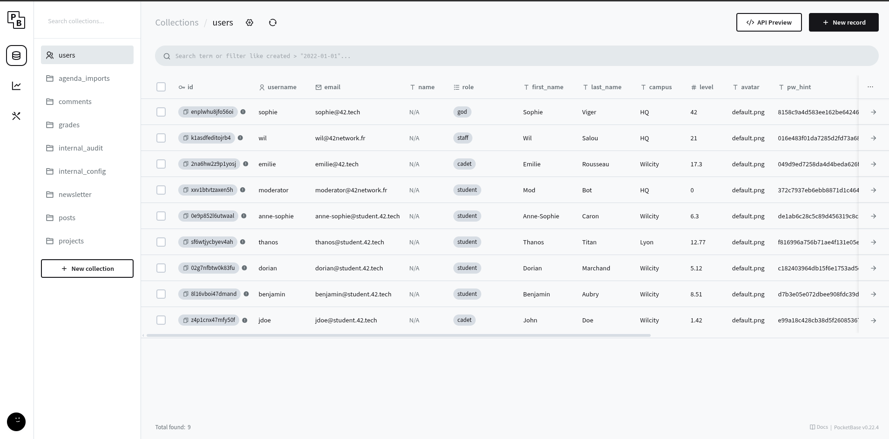
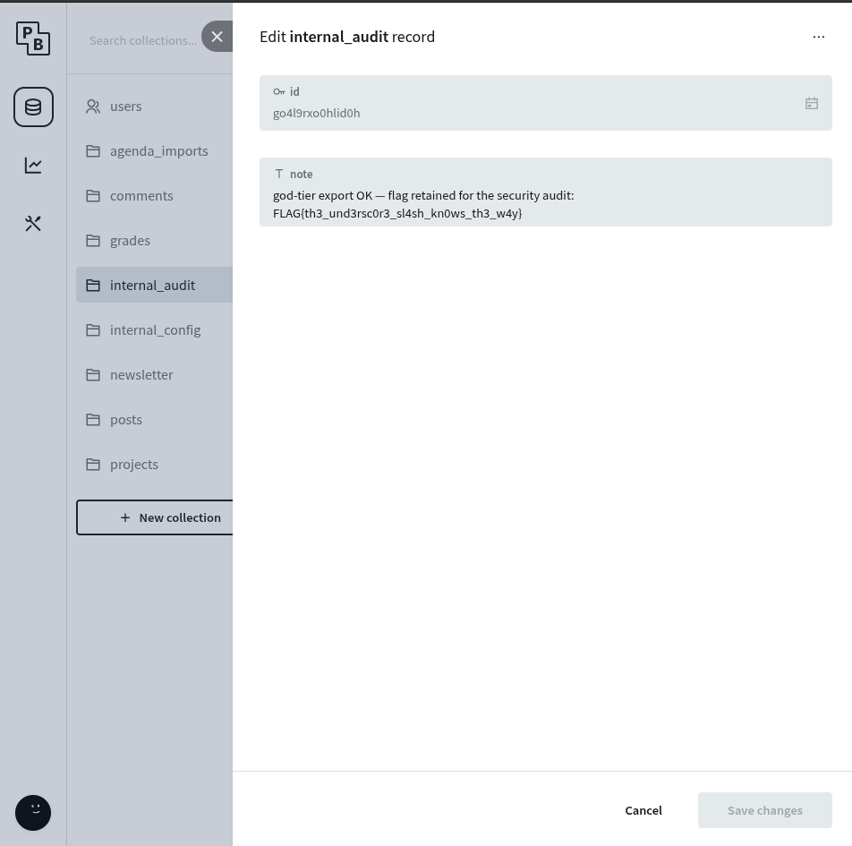

**A04 - Insecure Design - PocketBase Admin Panel**

Definition : PocketBase est un backend leger et open source qui fournit dans le cadre de Darkly une base de donnees SQLite, une API REST et une interface d'administration.  
Il est utilise pour le stockage des differentes donnees de l'app comme les users, les projets et les notes.

Avoir acces a ce back-end permet de manipuler directement l'xp que l'on veut s'attribuer, modifier les projets etc ... 

**Processus de decouverte et reproduction :**  
La faille precedente sur la vulnerabilite XXE nous permet d'avoir les credentials suivant :  
```
username : admin@42network.local
password : Darkly42Admin!
```  
  

D'ici, nous avons acces a la collection `internal_audit` qui contient le flag correspondant a l'acces au role `god`  

  

Flag : `FLAG{th3_und3rsc0r3_sl4sh_kn0ws_th3_w4y}`
