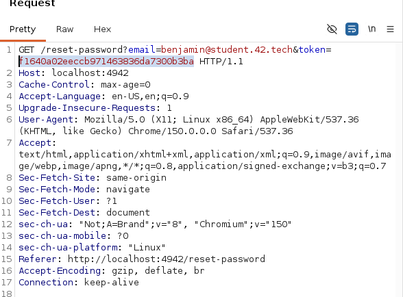
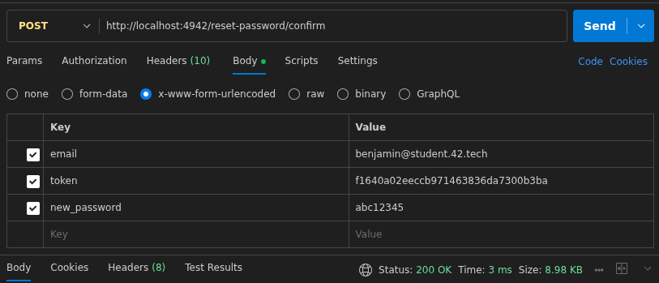

## Vulnerabilite : Identification and Authentication Failures

Definition : 

Pour cette occurence, la vulnerabilite de reinitialisation de mot de passe avec un token previsible et deterministe survient lorsque le token de reset est genere a partir de donnees facilement connaissable comme l'adresse e-mail. Un attaquant peut alors calculer un token valide sans avoir acces a la boite mail, compromettant alors son compte. 

## Processus de decouverte et reproduction: 

Le point d'entree est le post forum de Benjamin sur le flow de reinitialisation de mot de passe. Toujours avec le navigateur integre de Burp, j'ai checke les requetes HTTP du processus. Je me suis apercu que pour generer le token, l'application se contente de hash l'adresse mail du compte que l'on souhaite attaquer. 

Ici, `benjamin@student.42.tech` : 

```
╰─ echo -n "benjamin@student.42.tech" | md5sum                             ─╯
f1640a02eeccb971463836da7300b3ba  -
```



Si on check le code source, on peut savoir quelle requete nous permet de reinitialiser le mdp et ce qu'elle attend : 

```html
form method="POST" action="/reset-password/confirm">
    <input type="hidden" name="email" value="benjamin@student.42.tech">
    <input type="hidden" name="token" value="f1640a02eeccb971463836da7300b3ba">
    <div class="form-group">
      <label class="form-label">New password</label>
      <input class="input" type="password" name="new_password" placeholder="••••••••••" autocomplete="new-password" required>
    </div>
```

On connait : 
- L'email : `benjamin@student.42.tech`
- Le token : `f1640a02eeccb971463836da7300b3ba`
- Ne reste qu'a renseigner Le `new_password`: `<password de votre choix>`

Via une requete POST sur la route suivante : `http://localhost:4942/reset-password/confirm`

Qui accepte pour les champs un `x-www-form-urlencoded` (je l'ai decouvert a mes depends en essayant de lui balancer en JSON et me taper une 422).

On passe donc sur POSTMAN et on teste ca : 



Ca nous donne une 200, on va se log avec le nouveau mot de passe, on va dans l'edition de profil et on decouvre le flag. (Present uniquement sur l'utilisateur Benjamin). 


