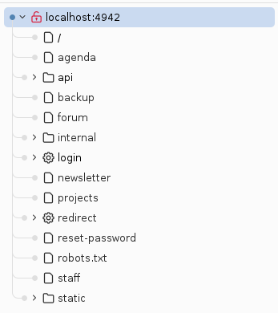
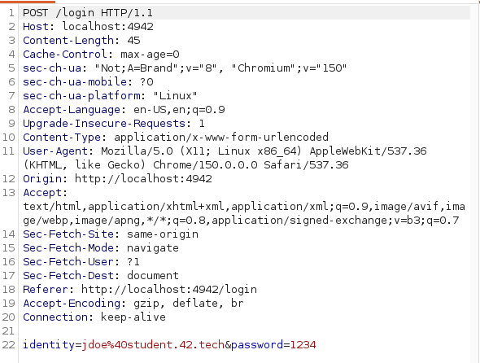

## Vulnerabilite user : BruteForce mot de passe utlisateur

Definition : 

## Processus de decouverte : 

En regardant des videos YouTube sur les failles OWASP les plus courantes j'ai decouvert Burp Suite. 
Je vous epargne les tutos pour apprendre a BruteForce avec l'outil mais je vous detaille ici les steps pour reproduire. 

1. On lance Burp Suite, qui possede un navigateur integre. En tapant sur l'URL desire, un crawler permet de nous donner tous les chemins d'acces disponible sur l'app. 



2. A partir de la, il nous faut une adresse mail valide pour envoyer un requete post sur `/login` et voir ce que l'api attend dans le payload pour l'email et le mot de passe. Sur la page Newsletter on voit que le nom de domaine pour les mails est `@student.42.tech`. 
Dans le navigateur de Burp on test ce log donc avec un mail valide et n'importe quel mdp. 



Verifiable egalement dans le code source de la page, pour l'email `identity=<email@student.42.tech>` et pour le mdp `password=<password>`

3. Ce qu'on veut faire, etant donne qu'on sait que l'utilisateur John Doe a un mot de passe faible, on va lancer une attaque via une requete POST sur `/login`, en modifiant a chaque fois `password=<10kcommon_password>`, source : [10kcommon](https://github.com/danielmiessler/SecLists/blob/master/Passwords/Common-Credentials/10k-most-common.txt). 

On pourrait differencier le bon mot de passe des mauvais grace a la len de la reply. L'API renvoie sur `/login?error=Invalid+credentials` en cas de mauvais mdp. Sinon on peut faire un grep - Extract sur ce qui arrive apres la redirection, en l'occurence `location: /<etc...>`. 

Voila le resultat du BruteForce : 


On peut donc se log a la session de John Doe avec les credentials suivants : 

```
identity: jdoe@student.42.tech
password: abc123
```

